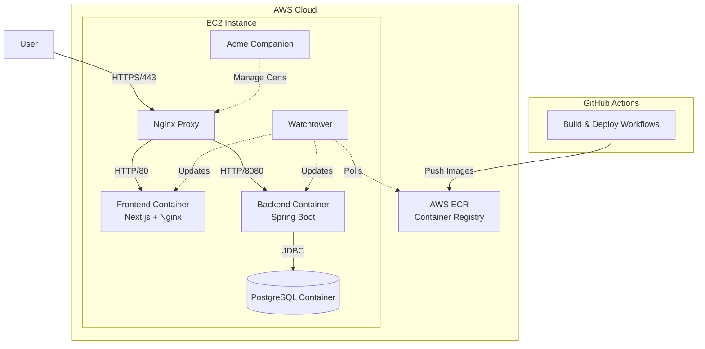

# EdgeCase

**EdgeCase** is a full-stack web application designed for reporting and viewing incidents related to BASE jumping. It serves as a centralized platform for the community to share safety information, analyze trends, and improve risk management.

[**View Live Application**](https://edgecase.masonak.dev)

## System Architecture

The application follows a containerized microservices architecture orchestrated by Docker Compose on AWS.

## Documentation

Detailed documentation for this project can be found in the `docs/` directory:

- **[Design Document](docs/DESIGN.md)**: System architecture, diagrams, and data design.
- **[Developer Setup Guide](docs/DEVELOPER_SETUP.md)**: Instructions for setting up the local development environment.
- **[User Guide](docs/USER_GUIDE.md)**: Instructions for general users and moderators.
- **[Testing Documentation](docs/TESTING.md)**: Test plan, unit test locations, and results.
- **[Cloud Deployment Guide](docs/CLOUD_DEPLOYMENT.md)**: Architecture decisions and container implementation details.

## Project Structure

This monorepo contains the following components:

- **`frontend/`**: A Next.js application built with TypeScript, Tailwind CSS, and Shadcn UI.
- **`backend/`**: A Java Spring Boot application providing a REST API.
- **`ops/`**: Infrastructure configuration, including Docker Compose files for production.
- **`.github/workflows/`**: CI/CD pipeline definitions using GitHub Actions.

## Technologies

- **Frontend**: Next.js (React), TypeScript, Tailwind CSS, Jest (Testing)
- **Backend**: Java 17, Spring Boot 3.5.7, Spring Security
- **Database**: PostgreSQL, Flyway (Migrations)
- **Infrastructure**: Docker, Docker Compose, Nginx, Let's Encrypt, Watchtower, AWS (EC2, ECR)

## Deployment

The application is containerized using **Docker** and orchestrated with **Docker Compose**. It is deployed on a single **AWS EC2** instance.

- **Docker Compose**: In production, a `docker-compose.prod.yml` file defines the services. It pulls the specific image versions from ECR and orchestrates the containers, handling networking, environment variables, and volume mounts for data persistence.
- **SSL/TLS**: `acme-companion` automatically manages Let's Encrypt certificates.
- **Auto-Updates**: `watchtower` monitors AWS ECR for new images and automatically updates running containers.
- **Database**: Runs as a Docker container on the same EC2 instance.

## CI/CD Pipeline

The project uses **GitHub Actions** for automated building and deployment:

1.  **Build & Test**:
    - Backend: Compiles Java code using Maven and runs verification.
    - Frontend: Installs dependencies and builds the Next.js static site.
2.  **Deploy** (on `main` branch):
    - Builds Docker images for Backend and Frontend.
    - Pushes images to **AWS Elastic Container Registry (ECR)**.
    - Watchtower pulls the new images on the EC2 instance and restarts the services.

---

## License

This project is licensed under the MIT License. See the [LICENSE](LICENSE) file for details.

---

**Author**: Mason Wilcox 
**Email**: me@masonak.dev 
**Website**: [masonak.dev](https://masonak.dev) 
**Published**: November 22, 2025