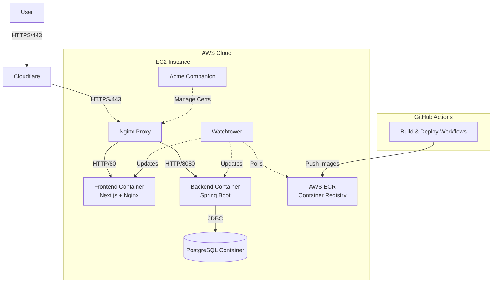
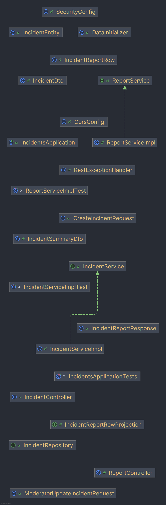

# EdgeCase Design Document

## 1. Introduction
EdgeCase is a full-stack web application designed for reporting and viewing incidents related to BASE jumping. It allows users to submit incident reports anonymously and provides a public interface for viewing these reports. A moderation interface is available for administrators to review and approve or retract submissions.

## 2. System Architecture

The application follows a containerized microservices-like architecture orchestrated by Docker Compose:

### 2.1 Frontend
- **Framework**: Next.js (React) with TypeScript.
- **Styling**: Tailwind CSS and Shadcn UI components.
- **Runtime**: Node.js container (static export served by Nginx).
- **Communication**: Consumes the backend REST API via client-side requests.

### 2.2 Backend
- **Framework**: Java Spring Boot (v3.5.7).
- **Runtime**: Java 17 container.
- **Database Access**: Spring Data JPA with Hibernate.
- **API**: RESTful endpoints secured by Spring Security.

### 2.3 Database
- **Engine**: PostgreSQL 16.
- **Hosting**: Docker container running on the EC2 instance.
- **Migration Tool**: Flyway is used for database schema management and migrations.

### 2.4 Infrastructure & Deployment
- **Orchestration**: Docker Compose manages the service lifecycle.
- **Edge Proxy**: Cloudflare provides DNS, CDN, and DDoS protection.
- **Reverse Proxy**: `nginx-proxy` handles routing, virtual hosts, and SSL termination.
- **SSL/TLS**: `acme-companion` automatically manages Let's Encrypt certificates.
- **Auto-Updates**: `watchtower` monitors AWS ECR for new images and updates containers automatically.
- **CI/CD**: GitLab CI builds images and pushes to AWS ECR.

## 3. Diagrams

### 3.1 System & Deployment Architecture

### 3.2 Backend Class Diagram

## 4. Data Design

The core of the application is the `incident` table. The schema is defined in `backend/src/main/resources/db/migration/V1__create_incidents_table.sql`.

### Key Entities
- **Incident**: Represents a reported event.
  - `id`: Unique identifier (Primary Key).
  - `status`: Current state (e.g., SUBMITTED, APPROVED).
  - `location`, `category`, `object_type`, `jump_type`: Categorical data about the jump.
  - `summary`: Detailed text description of the incident.
  - `occurred_at`: Date of the incident.
  - `created_at`: Timestamp of submission.

## 5. Security

### 5.1 Authentication & Authorization
- **Framework**: Spring Security.
- **Public Endpoints**:
  - `POST /api/incidents/submit`: Submit a new incident.
  - `GET /api/incidents/public`: View approved incidents.
  - `GET /api/reports/**`: View aggregate reports.
- **Protected Endpoints**:
  - `/api/incidents/moderation/**`: Requires `MODERATOR` role.
- **Credentials**: Currently uses an in-memory user manager with hardcoded credentials for the moderator role (MVP configuration).

### 5.2 CORS (Cross-Origin Resource Sharing)
CORS is configured to allow requests from:
- Local development: `http://localhost:3000`
- Production frontend: `https://edgecase.masonak.dev`
- Backend domain: `https://edgecase-backend.masonak.dev`
