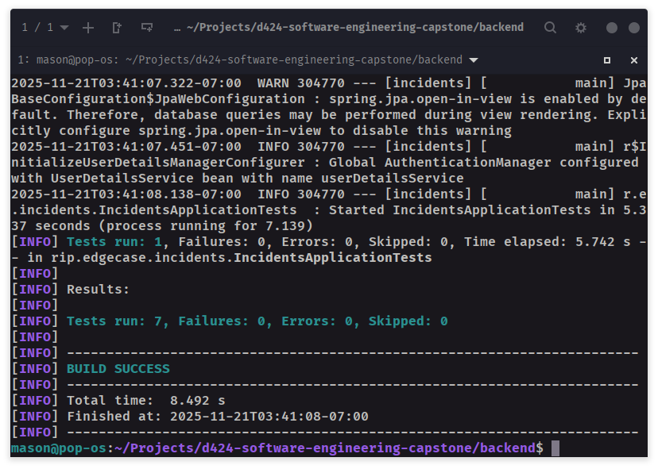
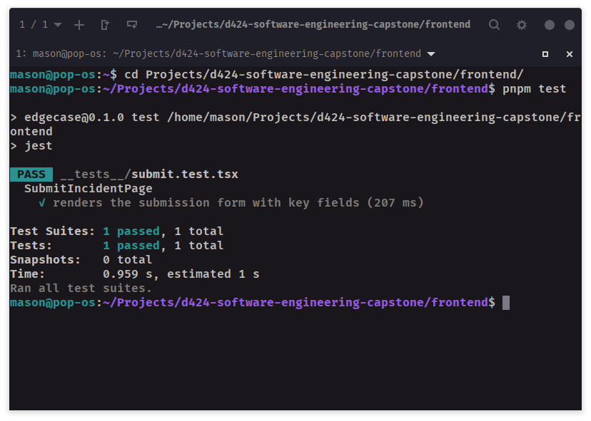

# Testing Documentation

## Test Plan

This document outlines the strategy for validating the core functionality of the EdgeCase application. The testing approach focuses on unit testing critical components in both the backend and frontend to ensure reliability and correctness.

### Objectives
- Verify the integrity of the incident submission process.
- Ensure backend services correctly handle data persistence and state transitions.
- Validate that the frontend submission form renders correctly and contains all necessary fields.

### Scope
- **Backend**: 
  - `IncidentServiceImpl` methods (submit, approve, retract).
  - `ReportServiceImpl` methods (generateIncidentSummary).
- **Frontend**: `SubmitIncidentPage` component rendering.

## Test Locations

The unit tests are located in the following directories within the monorepo:

- **Backend Tests**:
  `backend/src/test/java/rip/edgecase/incidents/`
  - Key files: 
    - `service/IncidentServiceImplTest.java`
    - `service/ReportServiceImplTest.java`

- **Frontend Tests**:
  `frontend/__tests__/`
  - Key file: `submit.test.tsx`

## Results

The following screenshots demonstrate the successful execution of the unit tests.

### Backend Test Results

### Frontend Test Results

